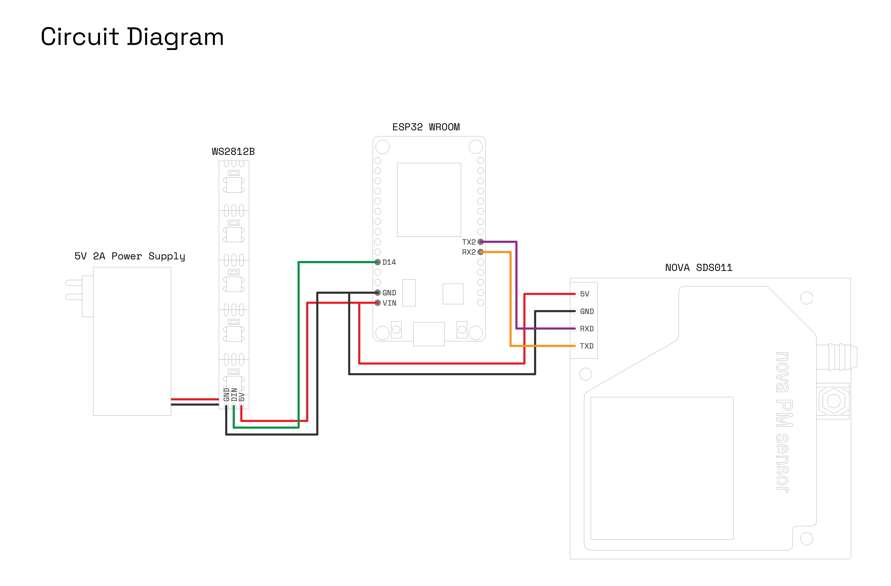

# My house is ill

This is the documentation for the tech used in the immersive exhibit on display at Khoj Studios from the 27th of April to 21st of May 2022.

The apartment uses 6 SDS011 sensors to track the Particulate Matter (PM2.5 and PM10) in the space. This sensor was chosen due it's relatively high accuracy and affordability. PM is a key component of the air pollution in New Delhi and is a good measure of the air pollution in any given space. 

The lighting of the space is also controlled by the ESP32, with PM10 values defining the colour on a spectrum from blue to red. The neopixel WS2812B strip is used for the lighting. The individually addressable LED strip also makes it possible to create animations. 

### Hardware Setup



### Software Setup

#### Arduino

- Download the [Arduino IDE](https://www.arduino.cc/en/software)
- Install the [ESP32 libraries](https://randomnerdtutorials.com/installing-the-esp32-board-in-arduino-ide-windows-instructions/)
- Go to Sketch -> Include Library -> Manage Library -> Type in "SDS011"
- Install the 'Nova Fitness Sds dust sensors library' by Pawel Kolodziejczyk
- Go to Sketch -> Include Library -> Manage Library -> Type in "FastLED"
- Install the 'FastLED' library by Daniel Garcia


#### Processing

- Download [Processing](https://processing.org/download)
- Go to Sketch -> Import Library -> Add Library -> Type in "UDP" in the search bar
- Download the UDP library by Stephane Cousot and click Install below.

### Multi ESP32+SDS011 Setup

#### Find MAC Address of the Main ESP32

This 'Main' ESP32 will collect data from other ESP's, hence we will need to find it's MAC Address.

Run this code below on the 'Main' ESP32 to find it's MAC address:

```
#ifdef ESP32
  #include <WiFi.h>
#else
  #include <ESP8266WiFi.h>
#endif

void setup(){
  Serial.begin(115200);
  Serial.println();
  Serial.print("ESP Board MAC Address:  ");
  Serial.println(WiFi.macAddress());
}
 
void loop(){
}
```

Open the Serial Monitor to see the MAC address

For Data logging: 

Mark the other ESP32's numerically as '1', '2', '3' and so forth, and flash the code from the folder Arduino/Support. Change the ```BOARD_ID``` number on each file which corresponds to each ESP. Remember the numbers-they are important! Replace the MAC address with the one from the 'Main' one. Also, add the Wifi SSID and change the interval the data is sent to the main ESP. It's currently at half a second (500 milliseconds).


### See Values in Processing

Find the local IP address of the computer which will run the Processing code. For the Mac, System Preferences -> Network

Change the value in the Main-Data-Logger.ino file:

``` #define CONSOLE_IP "192.168.0.206" //enter local ip address of computer using Processing ```

Open Processing/Sensor_Readout.pde from Github, and run that code. Values should start changing on the screen.

IMPORTANT: press 'r' on your keyboard before closing the sketch. This will save the file as a CSV and exit on it's own. Don't forget to press 'r' before closing!


### Authors

Abhimanyu Singhal, Depanshu Gola, Dhruv Singhal, and Salil Parekh
